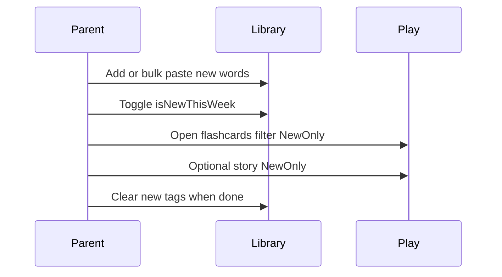
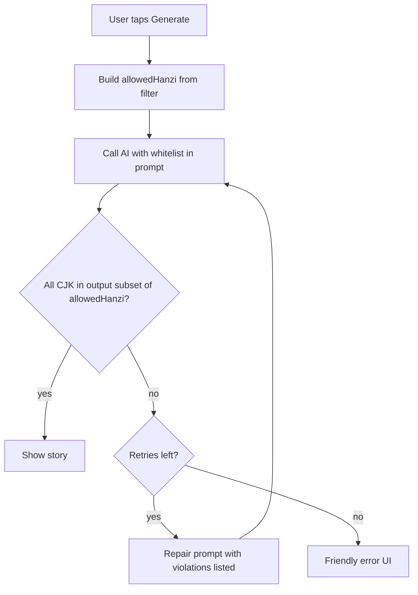

# Design: Family Chinese Reader

This document turns [PRD-chinese-family-reader.md](PRD-chinese-family-reader.md) into **screens, flows, states, and UI patterns** for implementation (Vite + React + TS + PWA + IndexedDB, per PRD).

---

## 1. Design principles

1. **Play is calm and big** — Few choices per screen; minimum readable **hanzi** size (see typography); generous tap targets (≥ 44px).
2. **Library is efficient** — Parent tasks (search, bulk add, tag, export) are dense but readable; no playful clutter.
3. **Truth in labels** — If **故事** is disabled, the UI says **why** (AI off, offline, no new words).
4. **Never surprise with new 汉字** — Story text is shown only after passing the whitelist check (or after a successful repair); never flash invalid text.
5. **Local-first honesty** — Export/import is visible so the family trusts they own the data.

---

## 2. Information architecture

| Area | Purpose | Primary actor |
|------|---------|----------------|
| **Play** | Flashcards, games, stories | Child (parent may co-read stories) |
| **词库** | CRUD, bulk paste, `new this week` | Parent |
| **Settings** | AI toggle, keys/proxy note, text size, backup | Parent |

**Suggested routes (SPA)**

- `/` — Redirect to `/play` or last visited (persist in settings).
- `/play` — Play hub.
- `/play/flashcards` — Card session.
- `/play/games` — Game picker.
- `/play/games/memory` — 配对.
- `/play/games/meaning` — 看字选义 (or hidden if no meanings).
- `/play/story` — Story builder + reader (gated).
- `/library` — Vocabulary list + editor drawers/modals.
- `/settings` — Parent controls.

**Bottom navigation (mobile)** — `玩` | `词库` | `设置` (icons + short labels). On desktop, use **left rail** or **top tabs** with the same three destinations.

---

## 3. Global layout and chrome

### 3.1 App shell

- **Header (optional on Play):** Minimal — only back chevron when inside a session. **Play hub** can be full-bleed cards with no top bar to reduce noise.
- **Safe areas:** Respect `env(safe-area-inset-*)` on notched phones.
- **Offline pill:** When `navigator.onLine === false`, show a small **“离线”** chip in header or above content (non-blocking). Story button stays disabled with reason.

### 3.2 Language of chrome

- **Play hub buttons:** Chinese labels as in PRD (**识字卡片**, **游戏**, **故事**) for immersion; optional English subtitles in smaller type for parent — **product choice:** default **Chinese-only** on Play, English allowed in Library/Settings if clearer for parent. Pick one per screen for consistency.

---

## 4. Design system

### 4.1 Typography

- **Font:** Noto Sans SC (PRD); system UI stack for Latin in Settings.
- **Hanzi scale (accessibility):**
  - **Play / flashcard front:** `clamp(3rem, 12vw, 5rem)` — large, responsive.
  - **Play / flashcard back:** `clamp(1.5rem, 5vw, 2.25rem)` for pinyin; meaning one step smaller.
  - **Story body:** `clamp(1.25rem, 4vw, 1.75rem)`; line-height ≥ 1.6.
  - **Library table/list:** 16px minimum body; hanzi column slightly larger.

**User setting:** “文字大小” — `small | normal | large` maps to CSS variables `--text-scale` (1 / 1.1 / 1.2).

### 4.2 Color (light-first, kid-friendly)

Use a **soft** palette; avoid neon; sufficient contrast (WCAG AA for text on surfaces).

| Token | Role |
|-------|------|
| `--surface` | Page background (warm off-white `#faf8f5`) |
| `--surface-elevated` | Cards (`#ffffff`) |
| `--primary` | Primary actions (soft teal or soft indigo — pick one brand hue) |
| `--primary-contrast` | Text on primary |
| `--accent-play` | Play hub card accents (three slightly different pastels per card) |
| `--text` | Main text `#1a1a1a` |
| `--muted` | Secondary labels |
| `--border` | Hairlines |
| `--danger` | Destructive / errors |
| `--success` | Validation passed |

**Dark mode (optional v1.2):** defer unless trivial; PRD does not require it.

### 4.3 Spacing and touch

- Base unit **8px**; card padding **16–24px**.
- **Minimum tap target:** 44×44px (Apple HIG); prefer 48px for Play.
- **Radius:** 16px cards, 12px buttons.

### 4.4 Core components

- **BigChoiceCard** — Full-width or two-column on tablet; icon + title + one-line subtitle; entire card is hit target.
- **PrimaryButton / SecondaryButton / TextButton**
- **Chip** — Filters (`全部` / `本周新字`), offline state.
- **WordRow** — Hanzi (large), pinyin, meaning truncated; star or toggle for `new this week`.
- **Modal / Drawer** — Add/edit word; bulk paste preview.
- **Toast** — Short confirmations (“已保存”, “已导出”).
- **EmptyState** — Illustration placeholder + CTA (“去词库添加词语”).
- **ConfirmDialog** — Delete word, replace library on import.

---

## 5. Screen specifications

### 5.1 Play hub (`/play`)

**Purpose:** One-tap entry to three modes.

**Layout**

- Title: **玩一玩** (or app name).
- Three **BigChoiceCard**s in a vertical stack (or 2+1 grid on wide screens).

**States — 故事 card**

| Condition | Appearance |
|-----------|------------|
| AI disabled in Settings | Card **dimmed**; subtitle: **在设置里打开 AI 故事** |
| AI on, offline | Dimmed; subtitle: **需要网络** |
| AI on, online, `NewOnly` with 0 new words | Enabled tap opens story screen then inline error (or subtitle **本周还没有新字**) — prefer subtitle on hub if count is cheap to compute |
| AI on, online, ready | Full color; subtitle: **用认识的字写小故事** |

**Games card:** Always active if word count ≥ minimum for at least one game; else subtitle **先添加更多字吧** linking to Library.

### 5.2 Flashcards (`/play/flashcards`)

**Controls (sticky footer or floating bar)**

- **Shuffle** (icon + label)
- **Filter:** segmented `全部` | `本周新字`
- **进度:** “3 / 12” optional; avoid anxiety — can show dots instead of numbers for child.

**Interaction**

- Tap card → flip (CSS 3D or cross-fade).
- Swipe left/right (optional) → next/prev word.

**Empty**

- No words: EmptyState → Library.
- Filter `本周新字` with none: toast **没有本周新字** + offer switch to `全部`.

### 5.3 Game picker (`/play/games`)

- List: **配对** (memory), **看字选义** (if ≥ N entries **with** `meaning`; else show row **disabled** with hint **先在词库里加上意思**).
- Show **recommended minimum** pairs (e.g. memory needs ≥ 6 cards → 3 pairs minimum; tune in build).

### 5.4 Memory game (`/play/games/memory`)

- Grid of face-down tiles; tap two to flip; match stays open.
- **End:** Confetti-lite animation (CSS) + **再玩一次** / **回游戏**.
- **Too few words:** block entry with modal explaining minimum.

### 5.5 Meaning quiz (`/play/games/meaning`)

- Top: large **hanzi**.
- Bottom: 3–4 **PrimaryButton** style choices (meanings); one correct.
- Wrong answer: gentle shake + try again (same word) or move on — **recommend:** allow one retry then next.
- If meanings missing for many rows, hide game from picker (above).

### 5.6 Story — gated (`/play/story`)

**Step A — Options (single scrollable form)**

- **用哪些字：** radio — **全部认识的字** | **只有本周新字**
- **长度：** `很短` | `短` | `稍长` (maps to token/word limits in API layer).
- **主题 (可选):** chips or text field — e.g. 动物, 学校, 家庭, 自定义…
- **生成** — Primary; disabled if gated conditions fail.

**Step B — Loading**

- Skeleton paragraphs; copy **“正在编故事…”**; cancel button.

**Step C — Reader**

- Rendered story in large type; optional **parent read-along** line (English theme label small at top — not part of story body).
- **Actions:** **再生成一篇** (same options), **返回** (lose draft unless “favorite” in v1.2).
- **Validation failure UI:** No raw model output. Message: **故事里有还没学的字，我们再试一次？** + button **重试** (counts toward retry budget). After final failure: **今天先读识字卡片吧** + link to flashcards.

### 5.7 Library (`/library`)

**Top bar**

- Search (by hanzi / pinyin / meaning).
- **添加** → modal (single add).
- **批量** → bulk paste flow.
- Overflow: **全选本周新字** / **清除本周标记** (batch) — optional if per-row toggle exists.

**List**

- Virtualized list if > 200 rows (nice-to-have).
- Each **WordRow:** hanzi, pinyin, meaning snippet, toggle **本周新字**, edit icon, delete (long-press menu on mobile).

**Bulk paste flow**

1. Textarea: one word/line; optional simple format `字,pinyin,meaning` documented in help tooltip.
2. **预览** table: duplicates highlighted; invalid lines flagged.
3. **导入** → success count toast.

**Import JSON**

- File input + confirm **replace vs merge** (PRD: backup — default **merge** with duplicate skip safer than silent replace).

**Export JSON**

- Download `family-chinese-reader-backup-YYYY-MM-DD.json`.

### 5.8 Settings (`/settings`)

- **AI 故事** — master toggle; when off, show short explanation.
- **API / 隐私** — copy: keys stored locally or via proxy; link to README section.
- **文字大小** — three-step control.
- **数据** — Export / Import buttons (duplicate of Library is OK; Settings is canonical “backup”).
- **关于** — version, PRD link (optional).

---

## 6. Key user flows (mermaid)

### 6.1 Weekly parent flow

### 6.2 Story generation (system)

---

## 7. Data and settings (UI-facing)

Align with PRD **F1**; expose in Settings/Library as needed.

| Field | UI |
|-------|-----|
| `hanzi` | Required everywhere |
| `pinyin`, `meaning` | Optional columns; drive Meaning game availability |
| `isNewThisWeek` | Toggle + batch actions |
| `settings.aiStoriesEnabled` | Settings toggle |
| `settings.textSize` | Settings |
| `settings.lastRoute` | Optional convenience |

---

## 8. PWA and onboarding

- **First visit:** 1–2 screen **carousel** — (1) data stays on device, (2) add words in 词库, (3) Play. **Skip** to Play if sample data not desired (no sample data in v1 to avoid wrong learning set — **empty start** + illustration).
- **Install prompt:** After first successful Library save, subtle banner **“添加到主屏幕”** (iOS/Android copy variants in i18n table later).

---

## 9. Accessibility

- Focus order matches visual order; visible focus rings on desktop.
- Buttons have `aria-label` where icon-only.
- Story reader: semantic `<article>`; loading uses `aria-busy`.
- Respect **prefers-reduced-motion:** disable confetti / flip exaggeration.

---

## 10. Copy deck (bilingual snippets)

| Context | Suggested copy |
|---------|----------------|
| Story disabled | 在「设置」里打开 AI 故事 |
| Offline | 需要网络才能生成故事 |
| New words empty | 本周还没有新字，先去词库标记吧 |
| Validation fail | 故事里有还没学的字，我们再试一次？ |
| Export done | 已导出备份文件 |

---

## 11. Build order (design → eng)

1. App shell + routes + nav + design tokens.
2. IndexedDB schema + Library list + add/edit + bulk paste + import/export.
3. Flashcards session.
4. Game picker + Memory + Meaning (gated by data).
5. Settings (AI toggle, text size).
6. Story UI + integration behind feature flag + validator UX.

---

## 12. Open decisions (resolve during implementation)

1. **Play chrome language:** Chinese-only vs bilingual subtitles on Play hub.
2. **Memory minimum pairs:** Exact threshold from real child testing.
3. **Meaning game:** Require `meaning` for ≥ X% of deck vs fallback “pick the same character”.
4. **AI provider:** Single provider in v1.1; UI copy stays generic (“AI 故事”).

This design is the source for component breakdown and acceptance tests alongside the PRD.
