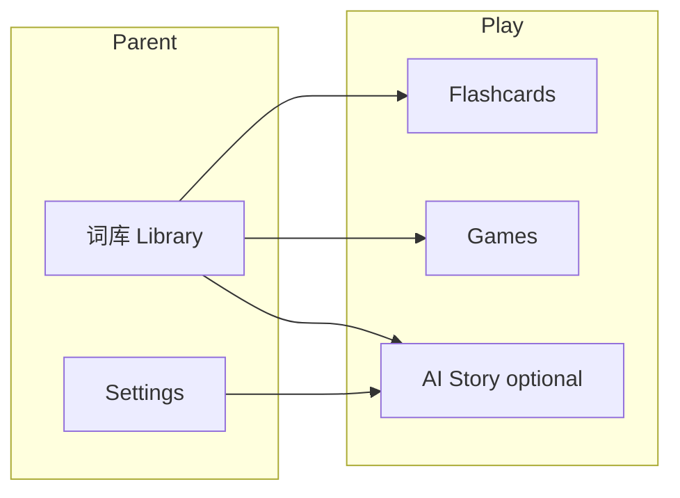

# PRD: Family Chinese Reader (女儿中文学习)

## 1. Summary

This PRD defines a **small, offline-first web app (PWA)** that stores the Chinese characters/words a child already knows, offers **识字卡片** and **simple games** that work without the internet, and optionally generates **short Chinese stories** using an AI **only when the parent turns the feature on**—with stories limited to either **all known words** or **only words marked “new this week.”**

## 2. Contacts

| Name | Role | Notes |
|------|------|--------|
| Liping Zhou | Parent / product owner | Owns word list, weekly updates, and whether AI is enabled |
| (Child) | Learner | Primary user of Play mode; age-appropriate UX |
| (Engineering) | Builder | May be the same person; this PRD is for clarity and scope |

## 3. Background

- **Context:** A young learner knows roughly **100 Chinese characters/words** and adds new words **every week**. Generic apps rarely match *her exact* known set, so practice feels too hard or too easy.
- **Why now:** Parents want **one place** for the family’s list, **fun repetition** (cards + games), and **stories that only use words she is allowed to see**—without hunting for matching readers.
- **What’s newly possible:** Personal devices + PWAs make a **private, installable** tool practical; **optional** AI can assemble stories from a **strict character whitelist** if we validate output.

## 4. Objective

**Objective:** Help a beginner **stay interested** in Chinese by practicing **only vocabulary she already “owns”** (or a chosen subset), with **low parent effort** each week.

**Why it matters:** Confidence grows when reading and games align with what she knows; mismatched materials increase frustration.

**Alignment:** This is a **family learning** initiative, not a commercial product—success is measured by **engagement and consistency**, not revenue.

**Key results (SMART-style):**

1. **KR1 — Weekly update:** Parent can add/tag new words and start a practice session in **under 5 minutes** (median), once familiar with the app.
2. **KR2 — Offline reliability:** With AI disabled (or no network), child can complete **flashcards + at least one game** in **100%** of sessions (no dependency on network).
3. **KR3 — Vocabulary safety (when AI on):** For AI-generated stories, **100%** of Chinese characters in the shown story pass a **whitelist check** against the selected set (full library or new-only); failed generations **do not** show invalid text without repair or clear error.
4. **KR4 — Learner engagement (qualitative + light quant):** Child willingly opens the app **≥ 3× per week** for **2+ weeks** after onboarding (parent-reported is acceptable for v1).

## 5. Market segment(s)

**Primary job-to-be-done:** “When my child is learning Chinese at home, I want activities **matched to the exact words she knows**, so she can **enjoy practice** and I can **update the list weekly** without rebuilding materials myself.”

**Users:**

- **Parent (admin):** Manages 词库, tags “new this week,” toggles AI, exports backup.
- **Child (player):** Uses large-touch, playful **Play** flows; should not need to manage settings.

**Constraints:**

- **Privacy:** Data stays **local-first** (device); no account system required for v1.
- **Reading level:** Beginner; stories are **short**; no assumption of full sentence literacy without parent support.
- **Device:** Phone/tablet/desktop browser; **PWA install** is a target, not a hard requirement for MVP if time is tight.

## 6. Value proposition(s)

| Need | What we offer | Pain avoided |
|------|----------------|--------------|
| Materials match her level | All activities pull from **your** word list | Too-hard readers or random word apps |
| Fun + variety | Cards + games + optional stories | Drill-only boredom |
| Weekly rhythm | Tag **new words**; choose **new-only** vs **full library** for stories | Mixing old and new unpredictably |
| Trust in “allowed characters” | Whitelist + **validation** (and retry) for AI output | AI introducing unknown 汉字 |
| Portability | JSON **import/export** | Lock-in or losing the list |

**“Better than” generic apps:** Personal vocabulary + optional **constrained** generation tied to **that** list (and subset).

## 7. Solution

### 7.1 UX / flows (high level)

- **Play hub:** Big buttons: **识字卡片**, **游戏**, **故事** (故事 greyed/disabled when AI off or offline).
- **Library:** List/search entries; add/edit/delete; **bulk paste**; toggle **“new this week”** per item (or batch action).
- **Story builder (if enabled):** Choose **character set:** `FullLibrary` | `NewOnly`; choose **length** (short default); optional **theme**; **Generate** → show story; **Save favorite** (optional stretch).
- **Settings:** AI on/off; provider/key approach (see tech); font size; **export/import** JSON.

### 7.2 Key features (requirements)

**F1 — 词库 (vocabulary)**

- CRUD on entries: `hanzi` (required); optional `pinyin`, `meaning`, `notes`.
- Support **multi-character 词** in one row (same model).
- **Tag:** `isNewThisWeek` (boolean or equivalent).
- **Bulk add:** paste lines → preview → import.
- **Import/export JSON** (full backup including tags).

**F2 — 识字卡片**

- Flip: front **hanzi**; back **pinyin/meaning** if present, else hanzi-only hint.
- Shuffle; filter: **all** | **new only**.
- Large type; kid-safe colors (no dependency on account).

**F3 — 游戏 (offline, MVP)**

- **Game A — 配对 (memory):** Uses distinct entries; if too few cards, show message and suggest flashcards.
- **Game B — 看字选义** (if meanings exist): multiple choice meaning for shown hanzi; fallback variant if no meanings (e.g. **match two identical hanzi** or **pick the same character from a small grid**—product decision at build: prefer requiring meanings for Game B).

**F4 — 故事 (optional AI, online)**

- **Gate:** Only available when **parent enables** AI in Settings **and** device is online (or show clear “needs internet”).
- **Inputs:** Character set = **FullLibrary** or **NewOnly**; length; optional theme (Chinese or English theme labels OK).
- **Constraint:** Prompt includes **explicit allowed Hanzi set** (and instruction: no other Chinese characters).
- **Validation:** After generation, scan all CJK characters in output; must ⊆ allowed set. On failure: **one automatic retry** with repair instructions; if still failing, show **friendly error** (“故事里有还没学的字，我们换一篇试试”).
- **Empty set handling:** If `NewOnly` and zero new words, block with explanation.

**F5 — Delight (post-MVP / Phase 3)**

- Stars/stickers for completed sessions (local).
- Printable PDF cards (later).
- TTS (later, likely online).

### 7.3 Technology (directional)

- **Client:** Vite + React + TypeScript; **PWA** for install/offline shell.
- **Storage:** IndexedDB (e.g. Dexie) for vocab + settings.
- **Fonts:** Noto Sans SC (or equivalent) for consistent 汉字 offline.
- **AI keys:** Prefer **proxy** (e.g. Cloudflare Worker) so keys are not in the browser; acceptable for personal prototype: **BYOK** with explicit risk warning.

### 7.4 Assumptions

- Parent will **curate** the list; we do not auto-grade “has she really learned it.”
- **Pinyin/meanings** improve games but are **optional** at data level; some games need fallbacks.
- AI will **sometimes** violate constraints; **validator + retry** is mandatory, not optional.
- **“New this week”** is **manual tagging** in v1 (no calendar magic required).

## 8. Release

| Phase | Scope | Rough timeframe |
|-------|--------|------------------|
| **MVP** | PWA shell + IndexedDB + Library + Flashcards + 1–2 offline games + import/export | First usable build |
| **v1.1** | Optional AI stories + whitelist validation + retry + settings | After MVP stable |
| **v1.2** | Stickers/stars, polish, accessibility (large tap targets, reduce clutter) | As needed |

**Out of scope (v1):** Social features, accounts, spaced-repetition science, curriculum alignment, speech recognition.

**Success gate for AI release:** Validator tests pass on sample outputs; airplane mode confirms **no** AI calls when disabled.

## Related planning

Implementation notes and stack choices live in the Cursor plan **Chinese learning app** (hybrid offline + optional AI stories).
